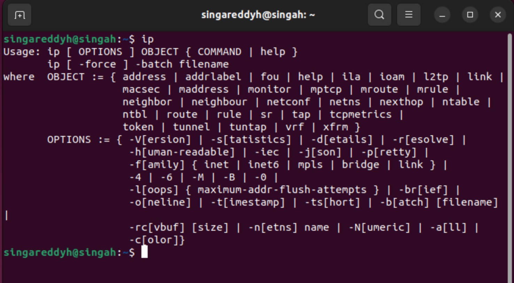

# Exploring Ubuntu Home Lab

This lab focuses on exploring the **network environment** of my Ubuntu virtual machine and identifying potential vulnerabilities. The goal is to understand how my server communicates on the network and ensure it is securely configured.

## 1. Identifying Network Interfaces and IP Addresses

**Command:**
ip a or ifconfig

**Observation:**
**ip a or ifconfig** displays all network interfaces and their assignment IP addresses. This helps me identify which interfaces are active and how my VM connects to the network.

**Output:**
 

## 2. Check Open Ports

**Command:**
sudo netstat -tuln or ss -tuln

**Observation:**
**sudo netstat -tuln or ss -tuln** lists all open TCP or UDP ports to identify what services are listening on my system.

**Output:**

## 3. Analyze Network Connections

**Command:**
sudo lsof -i -P -n

**Observation:**
**sudo lsof -i -P -n** lists all open network connections and the processes that own them. **lsof (List Open Files)** shows files and sockets opened by processes. The -i flag filters network files, while -P -n avoid name resolution for speed.

**Output:**

## 4. Perform Network Scanning with Nmap

**Command:**
sudo nmap -sS -O localhost

**Observation:**
**sudo nmap -sS -O localhost** shows all the open or closed ports where i have two open ports(port 22 and port 631) and 998 closed ports.

**Output:**

## 5. Check for Open Ports on the Server's Network

**Command:**
sudo nmap -sP 192.168.1.0/24

**Observation:**
**sudo nmap -sP 192.168.1.0/24** detected all live hosts on my local network and also ensures therre are no unauthorized devices connected.

**Output:**

## 6. Check for Services and Versions

**Command:**
sudo nmap -sV localhost

**Observation:**
**sudo nmap -sV localhost** scans for open ports and identifies service versions running on them. It detected the OpenSSH version and CUPS 2.8

**Output:**

## 7. Identify Potential Vulnerabilities

**Command:**
sudo nmap --script vuln localhost

**Observation:**
**sudo nmap --script vuln localhost** runs vulnerability scripts against local services. where Nmap detected a potential Slowloris vulnerability on my VM machine.

**Output:**

## 8. Inspect Network Traffic

**Command:**
sudo tcpdump -i ens160

**Observation:**
**sudo tcpdump -i ens160** captured 12 packets on my VM machine which appeares to be normal and minimal and none of them are dropped by the kernel.

**Output:**

## 9. Monitor Network Connections in Real-Time

**Command:**
sudo watch -n 1 netstat -tulnp

**Observation:**
**sudo watch -n 1 netstat -tulnp** continously monitors my network connections, updating every second which helps in oberserving new connections or services starting.

**Output:**

## 10. Check Firewall Rules

**Command:**
sudo ufw status verbose

**Observation:**
**sudo ufw status verbose** shows the status of the firewall. My firewall status is inactive because i don't have the setup yet.

**Output:**
